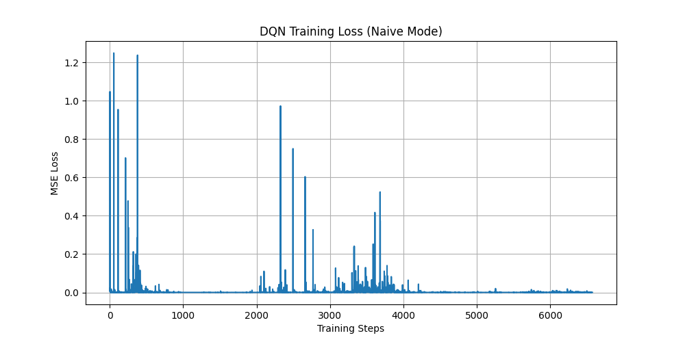
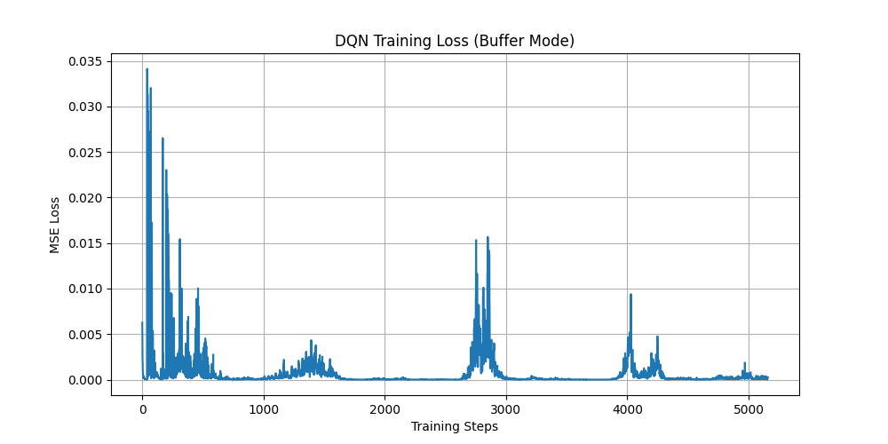
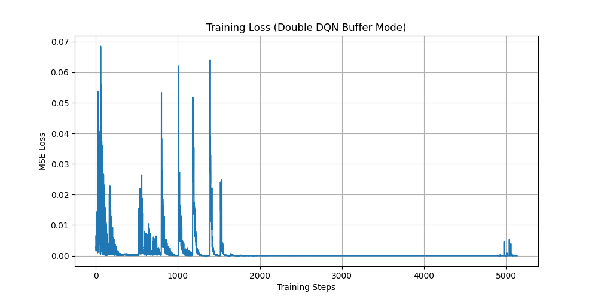
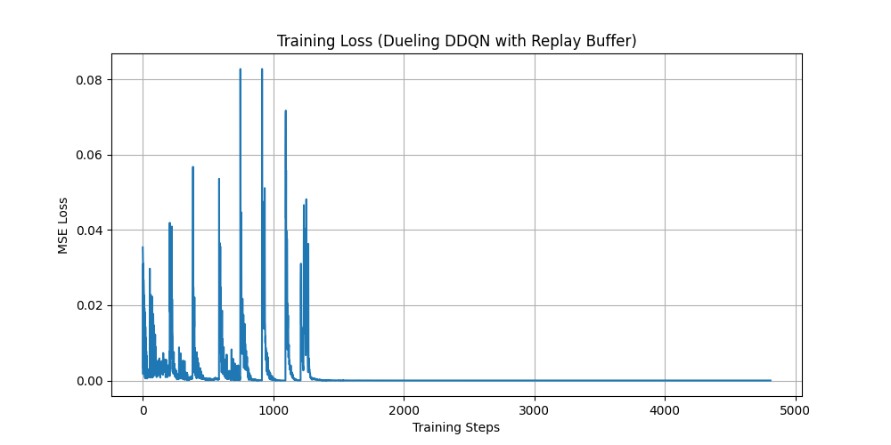

# 2026DRL-Hw3

This repository contains the code and reports for 2026 DRL Homework 3. 

## Structure Overview
- `env/`: Environment files (`GridBoard.py`, `Gridworld.py`).
- `report/`: Understanding and analysis reports for each section.
- `result/`: Training loss graphs and result images.

---

## 1. HW3-1: Naive DQN for static mode [30%]
*   **Code:** `hw3_1main.py`
*   **Report:** [HW3-1 Understanding Report](report/HW3-1_Understanding_Report.md)
*   **Results:**
    *   Naive DQN Loss:
        
    *   DQN with Experience Replay Buffer Loss:
        

## 2. HW3-2: Enhanced DQN Variants for player mode [40%]
*   **Code:** `hw3_2_Double_dqn.py`, `hw3_2_Dueling_DQN.py`
*   **Report:** [HW3-2 Enhanced DQN Report](report/HW3-2_Enhanced_DQN_Report.md)
*   **Results:**
    *   Double DQN Loss:
        
    *   Dueling DDQN Loss:
        

## 3. HW3-3: Rainbow DQN for random mode [20%]
*   **Code:** `hw3_3_DQN_random.py`, `hw3_4_rainbow_dqn.py`
*   **Report:** [HW3-3 Rainbow DQN Report](report/HW3-3_Rainbow_DQN_Report.md)

## 4. HW3-4: Report [10%]
*   **Final Report & Comparison:** [HW3-4 Final Report](report/HW3-4_Final_Report.md)
